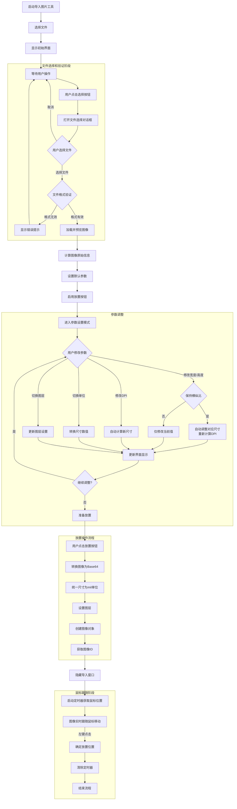
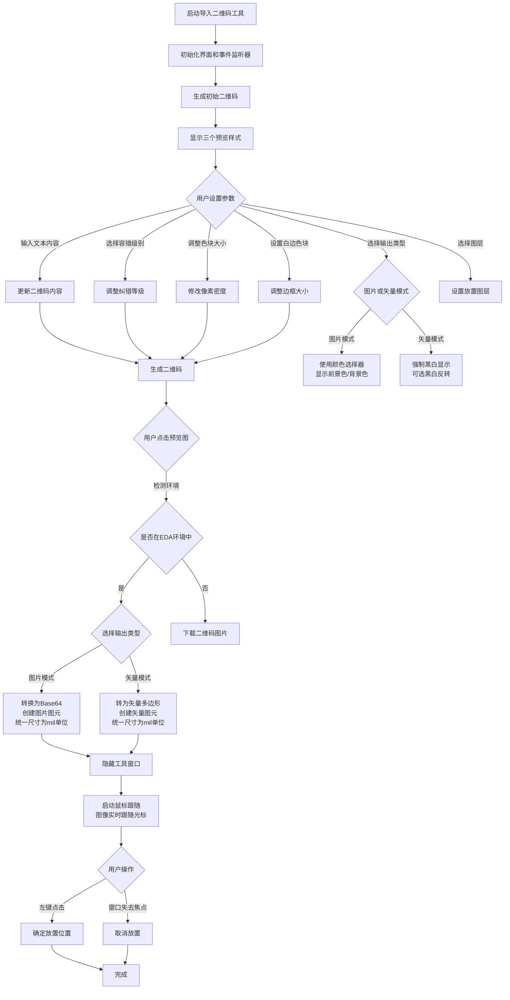
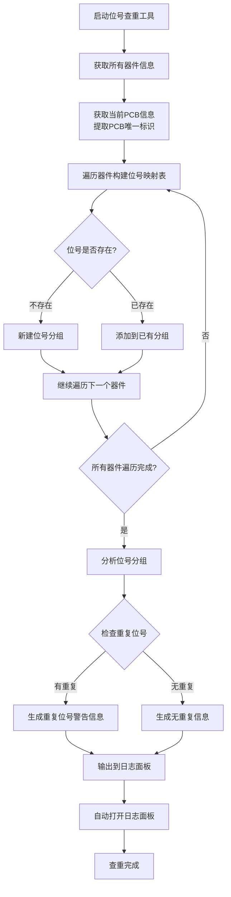
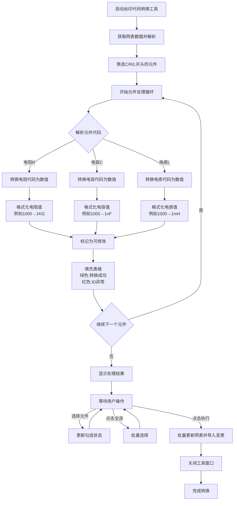
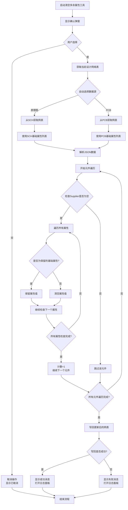
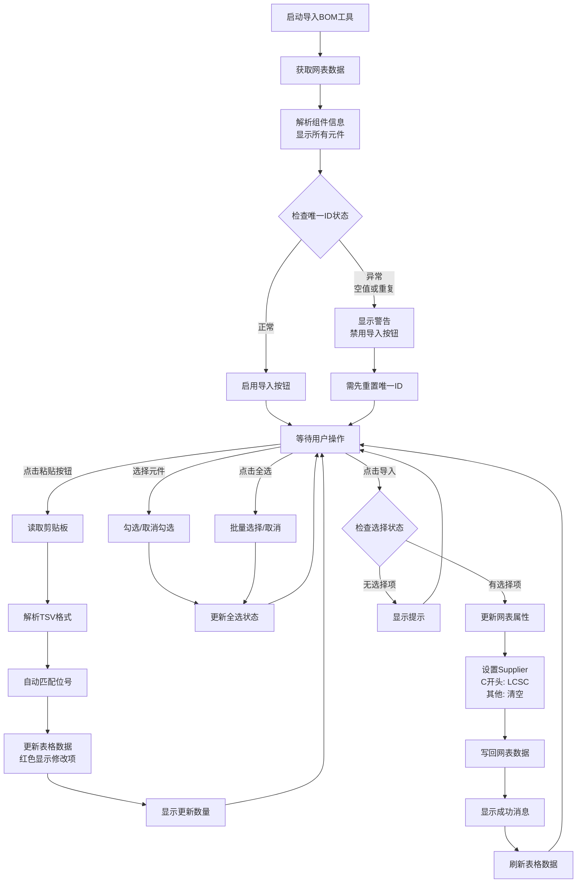
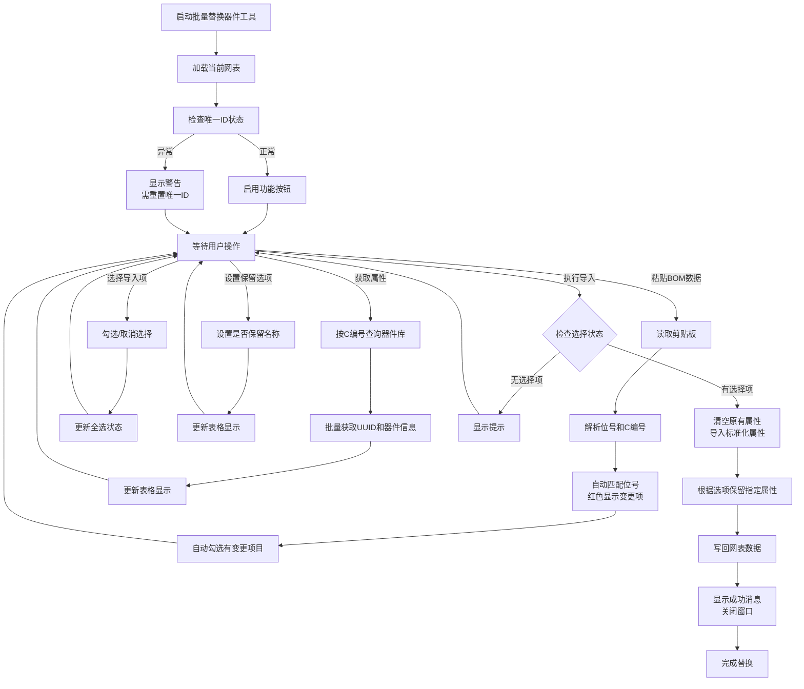
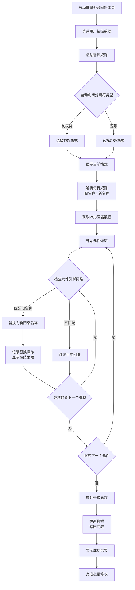
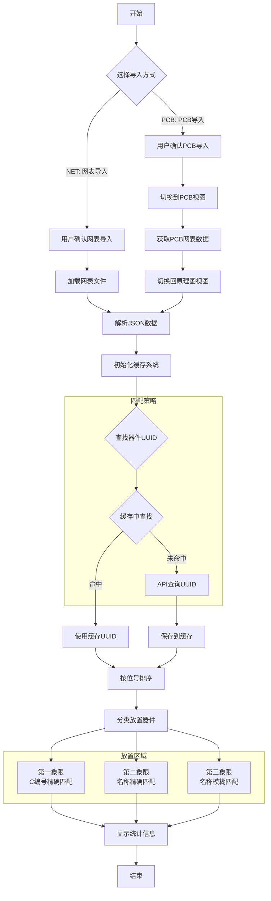
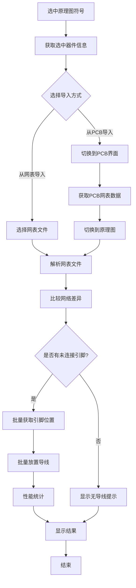

# 狼黑工具 - 使用文档

## 目录

### 安装方法
- [下载插件](#下载插件)
- [导入插件](#导入插件)

### 已发布
- [导入图片](#导入图片)
- [导入二维码](#导入二维码)
- [位号查重](#位号查重)
- [丝印代码转换](#丝印代码转换)
- [清空多余属性](#清空多余属性)
- [导入BOM](#导入bom)
- [批量替换器件](#批量替换器件)
- [批量修改网络](#批量修改网络)
- [放置器件](#放置器件)
- [放置导线](#放置导线)

### 待发布
- [过孔焊盘互转](#过孔焊盘互转)
- [线条导线互转](#线条导线互转)
- [批量修改封装名](#线条导线互转)
- [导入Gerber](#导入gerber)
- [创建封装](#创建封装)
- [生成网表](#生成网表)
- [显示飞线](#显示飞线)
- [导出资料](#导出资料)
- [工作时间统计](#工作时间统计)

### 关于
- [插件信息](#插件信息)
- [版本记录](#版本记录)
- [免责声明](#免责声明)

---

## 安装方法

### 下载插件

可在
[Github](https://github.com/WOLF4096/easyeda_wolfblack_tool)
或者
[嘉立创EDA扩展广场](https://ext.lceda.cn/item/darksteel/wolfblack-tool)
下载本插件  

---
### 导入插件
目前仅支持 **嘉立创EDA专业版**  

V2版本  
从下载文件导入：设置→扩展→扩展管理器→导入扩展→选择下载的插件导入→完成  

V3版本  
从下载文件导入：高级→扩展管理器→导入→选择下载的插件导入→完成  
从扩展广场安装：高级→扩展管理器→找到“狼黑工具”→点击安装→完成  


[演示视频](#url)  
[返回目录](#目录)  

---

# 已发布

## 导入图片



## 功能概述
这是一个用于在PCB设计环境中，不限制文件大小，导入图像的工具。  
用户可以选择图像文件，调整尺寸参数，并将图像放置到指定的PCB图层上。

## 使用步骤

### 第一步：选择图像
1. 自动弹出文件选择对话框，或者点击"选择/更换图像"按钮
2. 在弹出的文件选择对话框中选择PNG、JPG或BMP格式的图像文件  
   - 图像分辨率需在 16384*16384px 以内
3. 图像将显示在左侧预览区域

### 第二步：调整参数
1. **选择单位**：根据需求选择毫米(mm)或密耳(mil)
   - 切换单位时，尺寸数值会自动转换
2. **设置尺寸**：
    - 方式一：直接输入宽度和高度值
        - 默认保持图像横纵比，如需自由调整可取消勾选
    - 方式二：通过DPI设置自动计算尺寸
        - DPI值与尺寸相互关联，修改任一方会自动计算另一方
3. **选择图层**：根据需求选择图像放置的图层

### 第三步：放置图像
1. 点击"放置到画布上"按钮
   - 放置大尺寸图像时可能出现卡顿，属正常现象
2. 图像将跟随鼠标移动
3. 在画布上点击确定放置位置

[演示视频](#url)  
[返回目录](#目录)  

---


### 导入二维码



## 功能概述
二维码生成器，支持识别、生成和放置二维码到PCB设计中。  
工具提供三种不同风格的二维码预览，并支持图片和矢量两种输出模式。

## 使用步骤

### 第一步：生成二维码
1. 输入方式：
    - 在文本框中输入二维码内容
    - 点击"从二维码导入"按钮，识别图片中的二维码内容
2. 根据需要调整参数：
   - 选择容错级别（默认M级，15%容错）
   - 调整色块大小（默认20像素）
   - 设置白边色块（默认1个色块）
   - 设置二维码尺寸（默认25.4mm）
   - 选择输出类型：图片或矢量

### 第二步：选择图层
1. 根据输出类型选择放置图层：

    **图片模式支持**
   - 顶层丝印层  
   - 底层丝印层  
   - 文档层

    **矢量模式支持**
   - 顶层
   - 顶层丝印层
   - 顶层阻焊层
   - 顶层装配层
   - 底层
   - 底层丝印层
   - 底层阻焊层
   - 底层装配层
   - 文档层
   - 机械层
   - 钻孔图层


### 第三步：放置或下载二维码
1. 点击三个预览图中的任意一个
2. 自动检测运行环境选择相应处理方式  
    - **在 EDA 环境中**：二维码将跟随鼠标，点击左键确定放置位置  
    - **在普通浏览器中**：下载二维码图片（格式：年月日_时分秒_QRCode.png）

[演示视频](#url)  
[返回目录](#目录)  

---

### 位号查重




## 功能概述
位号查重功能用于检查PCB设计中的器件位号是否重复，确保每个位号在设计中唯一。

## 使用步骤

### 1. 启动查重
点击菜单栏中的"位号查重"

### 2. 自动扫描
工具将自动执行以下操作：
- 获取当前PCB中所有器件信息
- 提取每个器件的位号和ID
- 按位号进行分组统计

### 3. 查看结果
自动打开底部日志面板显示结果：

**有重复位号的情况：**
```
重复位号：R1(e256)、R1(e255)
重复位号：C3(e16)、C3(e64)
```

**无重复位号的情况：**
```
未发现重复位号
```

### 4. 快速定位
点击重复位号后的链接（如：`R1(e256)`），可以快速定位到对应的器件。

[演示视频](#url)  
[返回目录](#目录)  

---

### 丝印代码转换




## 功能概述
将电阻、电容、电感的紧凑代码转换为易读的工程值格式  
支持数字代码、E96系列、带单位表示法等多种编码方式  

## 使用步骤

### 1. 启动工具
- 在PCB或原理图页面运行工具
- 工具自动读取网络表数据

### 2. 查看转换结果
- 表格显示所有C/R/L开头的元件
    - **绿色**：成功转换的值（推荐修改）
    - **红色**：需要先重置ID（菜单栏-设计-重置唯一ID）

### 3. 选择要修改的元件
- 勾选需要更新的元件
- 支持全选/取消全选
- 仅勾选转换成功的元件

### 4. 执行转换
- 点击"执行"按钮
- 自动更新网表并导入变更

## 支持的代码格式

### 电阻（R开头）
- **3位数字**：100=10Ω，103=10KΩ
- **4位数字**：1002=10KΩ，4991=4.99KΩ
- **E96代码**：01A=100Ω，02C=1.02KΩ
- **带单位表示**：4R7=4.7Ω，2K2=2.2KΩ
- **特殊格式**：R01=10mΩ，R10=100mΩ

### 电容（C开头）
- **3位数字**：104=100nF，105=1uF
- **带单位表示**：2N2=2.2nF，4U7=4.7uF

### 电感（L开头）
- **3位数字**：101=100uH，102=1mH
- **带单位表示**：2R2=2.2uH，4N7=4.7nH
- **特殊格式**：R01=10nH，R10=100nH

## 注意事项
1. **唯一ID**：每个元件必须包含唯一ID
2. **转换验证**：执行前核对转换结果
3. **仅支持C/R/L**：其他类型元件不处理
4. **已含单位的跳过**：如10KΩ、100nF不会被转换


[演示视频](#url)  
[返回目录](#目录)  

---

### 清空多余属性




## 功能概述
清理供应商为空的元件更多属性，保持设计文件整洁。

## 使用步骤

### 1. 启动功能
- 在PCB或原理图页面运行"清空多余属性"
- 工具显示确认弹窗提示操作内容

### 2. 确认操作
- **是**：继续执行清理操作
- **否**：取消操作，显示已取消提示

### 3. 自动清理过程
系统自动执行以下步骤：
- 获取当前设计的网表数据
- 识别供应商为空的元件
- 保留基础属性
- 清空更多属性

### 4. 查看结果
- 显示处理成功的元件数量
- 自动打开日志面板查看详细信息
- 处理失败时显示错误提示

[演示视频](#url)  
[返回目录](#目录)  

---

### 导入BOM



## 功能概述
快速从Excel复制BOM数据，批量更新PCB设计中元件的制造商、供应商、型号等属性信息。

## 使用步骤

### 1. 准备BOM数据
- 在Excel中准备5列数据：
  1. **位号**：元件标识，如R1、C2
  2. **名称**：元件参数，如10KΩ、100nF
  3. **立创编号**：C开头的立创商城编号
  4. **制造商编号**：制造商编号
  5. **制造商名称**：制造商名称
- 选中数据区域，复制（Ctrl+C）

### 2. 粘贴BOM数据
- 打开工具后，点击"粘贴"按钮
- 工具自动匹配位号，更新对应元件
- **红色显示**：即将修改的属性
- **黑色显示**：保持不变的属性

### 3. 选择导入项目
- 勾选要导入的元件
- 支持"全选/全不选"批量操作
- 可只导入部分元件的属性

### 4. 执行导入
- 确认选择无误后，点击"导入"按钮
- 自动更新网表属性
- 显示成功导入的数量
- 表格自动刷新显示最新状态

## 数据格式要求

### 示例数据（必须按此顺序）
TSV格式，位号使用逗号分隔 （推荐此方法，从Excel复制）
|位号|名称|立创编号|制造商编号|制造商名称|
| ---- | ---- | ---- | ---- | ---- |
|H1,H2,H3|32P|C6112990|MTMM-132-09-T-S-430|SAMTEC|

CSV格式，位号使用顿号分隔
```
位号,名称,创编号,制造商编号,制造商名称
H1、H2、H3,32P,C6112990,MTMM-132-09-T-S-430,SAMTEC
```

## 自动处理规则
1. **Supplier设置**：
   - 立创编号以"C"开头 → Supplier="LCSC"
   - 其他情况 → Supplier=""
2. **唯一ID检查**：自动检测ID异常，需先重置唯一ID
3. **数据类型**：支持CSV和TSV格式自动识别

## 注意事项
1. **位号匹配**：依赖完全匹配位号来更新数据，确保没有重复位号
2. **数据验证**：粘贴后请仔细核对红色修改项
3. **备份建议**：重要设计导入前建议备份
4. **异常处理**：唯一ID异常时需先重置唯一ID再导入


[演示视频](#url)  
[返回目录](#目录)  

---

### 批量替换器件




## 功能概述
批量替换PCB设计中的器件，支持从立创商城C编号导入标准化器件属性，统一物料规格。

## 使用步骤

### 1. 准备替换数据
- 在Excel中准备2列数据：

|位号（多个用逗号分隔）|C编号|
| ---- | ---- |
|R1,R2,R3|C123456|
|C4,C5|C789012|

- 复制数据区域（Ctrl+C）

### 2. 粘贴数据
- 点击"粘贴"按钮
- 工具自动匹配位号，红色显示即将更新的C编号
- 有变更的项目自动被勾选

### 3. 获取器件属性
- 点击"获取属性"按钮
- 系统根据C编号查询器件库
- 获取标准化属性（制造商、型号等）
- 显示在表格中供核对

### 4. 设置导入选项
- **保留名称**：勾选后保留原有元件名称
- **保留封装**：存在bug，目前只能保留封装
- **保留3D模型**：存在bug，目前保留了无法应用

### 5. 执行替换
- 确认勾选要替换的元件
- 点击"导入文档"按钮
- 系统清空原有属性，导入标准化属性
- 显示替换成功数量，自动关闭窗口

## 注意事项
1. **唯一ID检查**：运行前自动检查，异常需先重置唯一ID
2. **封装限制**：API异常，无法修改封装，待后续更新
3. **备份建议**：重要设计替换前建议备份

[演示视频](#url)  
[返回目录](#目录)  

---

### 批量修改网络



## 功能概述
批量修改PCB设计中引脚的网络名称，支持从Excel复制批量修改规则，快速修改网络连接关系。

## 使用步骤

### 1. 准备替换规则
- 在Excel中准备2列数据：

|旧网络名称|新网络名称|
| ---- | ---- |
|GND1|AGND|
|VCC|3V3|
|Net1|CLK_IN|

- 复制数据区域（Ctrl+C）

### 2. 粘贴规则
- 打开工具，粘贴到输入框
- 工具自动检测格式（CSV/TSV）
- 显示检测到的格式类型

### 3. 执行替换
- 点击"执行"按钮
- 自动遍历所有元件引脚
- 显示实时替换进度和结果

### 4. 查看结果
- 结果框显示详细的替换记录
- 显示成功替换的总数
- 状态栏显示最终结果


[演示视频](#url)  
[返回目录](#目录)  

---

### 放置器件



# 使用步骤

1. **选择导入方式**：
   - 从当前PCB导入
   - 从嘉立创EDA格式网表导入

2. **确认操作**：
   - 根据提示对话框确认导入操作

3. **自动处理过程**：
   - 脚本自动查找器件UUID（优先C编号精确匹配）
   - 分三区域放置器件：精确匹配（右上）、名称匹配（左上）、模糊匹配（左下）
   - 在原理图中显示实时进度

4. **查看结果**：
   - 查看右下角统计信息
   - 检查模糊匹配和失败器件
   - 手动调整或删除提示文本

5. **注意事项**：
   - 运行过程中不要切换视图
   - 模糊匹配器件需要人工检查
   - 如果失败率过高，建议先进行器件标准化以提高匹配率

[演示视频](#url)  
[返回目录](#目录)  

---

### 放置导线



# 功能概述
用于在嘉立创EDA中自动放置导线的工具。它通过比较PCB/网表文件与原理图的网络差异，自动为未连接的引脚放置导线并标注网络名称，支持批量处理

# 使用步骤

1. **选择导入方式**：
   - 从当前PCB导入
   - 从嘉立创EDA格式网表导入

2. **准备阶段**：
   - 在原理图中选择一个或多个器件
   - 选择放置导线来源
        - 如选择PCB导入，脚本会自动切换到PCB界面获取数据
        - 如选择网表导入，选择对应文件

3. **自动处理过程**：
   - 脚本自动分析网络差异
   - 批量获取引脚位置信息
   - 按引脚朝向自动绘制导线

4. **查看结果**：
   - 检查生成的导线是否正确连接
   - 查看控制台中的性能统计信息
   - 验证网络标签是否正确标注

5. **注意事项**：
   - 确保选择的器件在PCB/网表中有网络定义
   - 仅处理原理图中未连接的引脚

[演示视频](#url)  
[返回目录](#目录)  

---

## 待发布

### 过孔焊盘互转

[返回目录](#目录)

### 线条导线互转

[返回目录](#目录)

### 批量修改封装名

[返回目录](#目录)

### 导入Gerber

[返回目录](#目录)

### 创建封装

[返回目录](#目录)

### 生成网表

[返回目录](#目录)

### 显示飞线

[返回目录](#目录)

### 导出资料

[返回目录](#目录)

### 工作时间统计

[返回目录](#目录)

---


## 关于

### 插件信息

**插件名称**: 狼黑工具 (WolfBlack Tool)  
**插件作者**: WOLF4096  
**开发平台**: 嘉立创EDA专业版 (基于 V2.2.43 开发，不保证 V3 完全兼容)  
**兼容版本**: V2 / V3 专业版  

### [更新日志](https://github.com/WOLF4096/easyeda_wolfblack_tool/blob/main/CHANGELOG.md) 

### 免责声明

**重要提示**：
1. **备份重要文件**：使用前请务必备份设计文件
2. **测试环境验证**：建议先在测试环境中验证功能
3. **数据安全**：使用第三方工具存在数据风险
4. **责任限制**：作者不对使用本工具造成的任何直接或间接损失负责

[返回目录](#目录)

---
